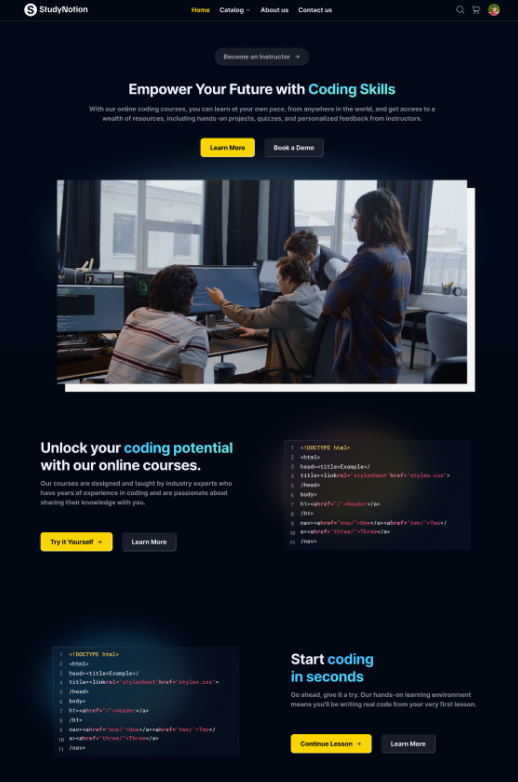

# Learn Sphere Online Education Platform (MERN App) [Website Link](https://studynotion-frontend.vercel.app/)

## Project Description

Learn Sphere is a fully functional ed-tech platform that enables users to create, consume, and rate educational content. The platform is built using the MERN stack, which includes ReactJS, NodeJS, MongoDB, and ExpressJS.  
Learn Sphere aims to provide:  
- A seamless and interactive learning experience for students, making education more accessible and engaging.  
- A platform for instructors to showcase their expertise and connect with learners across the globe.

The following sections cover the platform's technical details, including:  
1. System architecture: A high-level overview of the platform's components and architecture diagrams.  
2. Front-end: Details of the front-end architecture, user interface design, features, functionalities, frameworks, libraries, and tools used.  
3. Back-end: Details of the back-end architecture, features and functionalities, frameworks, libraries, tools used, and data models and database schema.  
4. API Design: Descriptions of API endpoints, their functionalities, and sample API requests/responses.  
5. Deployment: Information on the deployment process, hosting environment, infrastructure, and deployment scripts/configuration.  
6. Testing: Details of the testing process, testing types, and the frameworks/tools used.  
7. Future Enhancements: Potential future enhancements, their impact, and timelines for implementation.

In summary, Learn Sphere is a versatile and intuitive ed-tech platform designed to provide an immersive learning experience for students and a space for instructors to showcase their expertise. The following sections delve deeper into its features and functionalities.

---

## System Architecture

The Learn Sphere platform consists of three main components: the front end, the back end, and the database. The platform follows a client-server architecture, with the front end serving as the client and the back end/database as the server.

---

### Front-end

The front end of Learn Sphere is built using ReactJS, enabling dynamic and responsive user interfaces critical for engaging learning experiences. It communicates with the back end using RESTful API calls.

---

### Back-end

The back end of Learn Sphere is built with NodeJS and ExpressJS. It provides APIs for the front end to consume, including functionalities like user authentication, course creation, and course consumption. It also handles logic for processing and storing course content and user data.

---

### Database

The database is implemented with MongoDB, a NoSQL database offering flexible and scalable data storage. It stores course content, user data, and other platform-related information.

---

## Architecture Diagram

---

## Front End

The Learn Sphere front end includes pages for students, instructors, and admins:

### For Students:
- **Homepage**: Brief platform introduction and links to the course list and user details.  
- **Course List**: Displays all available courses, including descriptions and ratings.  
- **Wishlist**: Shows courses added to the student's wishlist.  
- **Cart Checkout**: Allows course purchases.  
- **Course Content**: Includes videos and materials for a selected course.  
- **User Details**: Displays student account information.  
- **User Edit Details**: Allows students to update their account details.

### For Instructors:
- **Dashboard**: Overview of the instructor's courses, ratings, and feedback.  
- **Insights**: Detailed insights into course performance metrics.  
- **Course Management Pages**: Create, update, delete courses, and manage course content/pricing.  
- **View/Edit Profile**: Manage instructor account details.

### For Admin (Future Scope):
- **Dashboard**: Overview of platform courses, instructors, and students.  
- **Insights**: Platform-wide metrics and analytics.  
- **Instructor Management**: Manage instructor accounts, courses, and ratings.  
- **User Management**: Manage student and instructor accounts.  

To build the front end, frameworks and libraries like ReactJS are used, along with CSS and Tailwind for responsive styling. Redux is employed for state management.

---

## Back End

### Description of the Back-end Architecture:
Learn Sphere uses a monolithic architecture, with the back end built using Node.js and Express.js, and MongoDB as the primary database.

### Features and Functionalities of the Back-end:
- **User Authentication**: Email/password login with OTP verification and password reset.  
- **Course Management**: CRUD operations for courses and media management.  
- **Payment Integration**: Razorpay for course purchases.  
- **Cloud-based Media Management**: Cloudinary for storing images, videos, and documents.  
- **Markdown Support**: Store course content in Markdown format for better rendering.

### Frameworks, Libraries, and Tools:
- **Node.js**: Primary framework for the back end.  
- **MongoDB**: Flexible and scalable data storage.  
- **Express.js**: Web application framework.  
- **JWT**: Secure authentication and authorization.  
- **Bcrypt**: Password hashing for enhanced security.  
- **Mongoose**: ODM for MongoDB.

### Data Models and Database Schema:
- **Student Schema**: Fields for name, email, password, and course details.  
- **Instructor Schema**: Fields for name, email, password, and instructor-specific course data.  
- **Course Schema**: Fields for course name, description, instructor details, and media content.

---

## API Design

The Learn Sphere platform's API follows REST principles. It uses JSON for data exchange and standard HTTP request methods (GET, POST, PUT, DELETE).

### Sample API Endpoints and Functionalities:
1. **POST /api/auth/signup**: Create a new user (student/instructor) account.  
2. **POST /api/auth/login**: Log in and generate a JWT token.  
3. **POST /api/auth/verify-otp**: Verify OTP sent to the user's email.  
4. **POST /api/auth/forgot-password**: Send a password reset email.  
5. **GET /api/courses**: Retrieve a list of all available courses.  
6. **GET /api/courses/:id**: Retrieve details of a specific course by ID.  
7. **POST /api/courses**: Create a new course.  
8. **PUT /api/courses/:id**: Update an existing course by ID.  
9. **DELETE /api/courses/:id**: Delete a course by ID.  
10. **POST /api/courses/:id/rate**: Add a rating to a course.

### Sample API Requests and Responses:
- **GET /api/courses**:
  - *Response*: A list of all courses in the database.  
- **GET /api/courses/:id**:
  - *Response*: Course details for the specified ID.  
- **POST /api/courses**:
  - *Request*: Course details in the request body.  
  - *Response*: The newly created course.  
- **PUT /api/courses/:id**:
  - *Request*: Updated course details in the request body.  
  - *Response*: The updated course.  
- **DELETE /api/courses/:id**:
  - *Response*: A success message indicating the course was deleted.

---

With this README, you can clearly understand Learn Sphere's features, architecture, and API design. This documentation ensures seamless development and collaboration.
